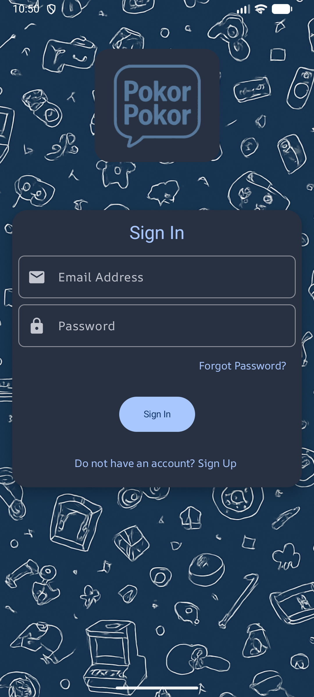
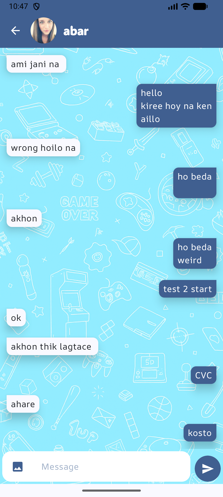
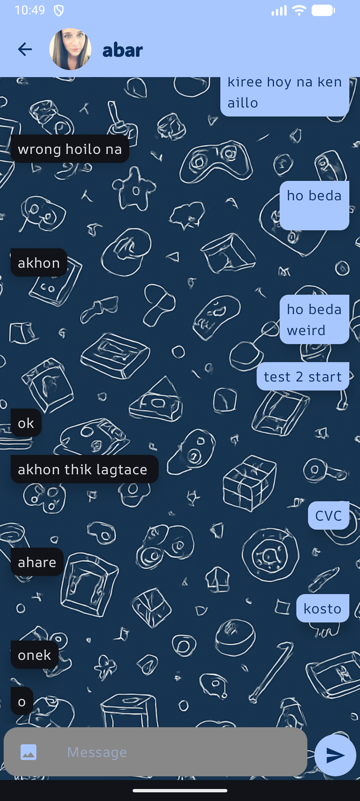

# 👋 Hi, I'm Meraj Hossen Akib  

I am an aspiring **Android developer** actively building projects to strengthen my skills in mobile development.  
I’ve applied **Jetpack Compose, Kotlin, Dagger Hilt, Retrofit, and RoomDB** in my apps, and I’m currently focused on gaining more confidence in independent development through real-world practice.  
---
## 📫 Contact  
- 📧 Email: [merajhossen20001@gmail.com](mailto:merajhossen20001@gmail.com)  
- 💼 LinkedIn: [linkedin.com/in/meraj-hossen-akib-005486291](https://www.linkedin.com/in/meraj-hossen-akib-005486291/)  

---

## 🛠️ Skills  
| | |
|---|---|
| Android Studio | Retrofit & REST APIs |
| Kotlin & Coroutines | Dagger Hilt |
| Jetpack Compose | RoomDB | 

---

## 📂 Projects  

### 🔎 Highlights
- 💬 **Pokor Pokor (Chat App)** – Learned Firebase-driven real-time flows with controlled fetching using Paging 3, handled structural design choices, and resolved several unexpected bugs. *(In Progress)*
- 🍲 **Food Recipe App** – Solo project to solidify knowledge and add bookmarking with RoomDB
- 📰 **News App** – Learned industry practices (Clean Architecture, MVVM, modern Android tools)
- 📺 **Notice Board TV App** – Real-world problem solving with kiosk mode for large displays

---

### 💬 Chat App (Pokor Pokor)

**Description:**  
An independently developed chat application for Android that includes essential features like user authentication, people search (by name or email), a dynamically updated chat list, and functioning real-time chat rooms with message synchronization.
🔗 [GitHub Repository](https://github.com/Akibilies20001/Pokor_Pokor)

**Motivation:**  
-Leaving the Comfort Zone: I stepped away from the safety of tutorials to build something complex from scratch, specifically to challenge myself with the unpredictable problems that real development brings.

-Learning Through Struggle: The biggest lessons came from the friction—debugging specific, unguided issues like that tricky keyboard input bug or getting Firestore sync right taught me more than any course could.

-Connecting the Dots: It wasn't just about writing code, but structural puzzle-solving; figuring out how to fit pieces like WorkManager into Clean Architecture really solidified my grasp on design patterns.

-Gaining Real Confidence: Ultimately, solving these unexpected roadblocks on my own proved to me that I can do more than follow instructions—I can engineer and finish a robust app independently.

**Tools Used:** Jetpack Compose, Kotlin, Dagger Hilt, Firebase Auth, Firestore, WorkManager  

**Future Work**
- Implement Profile Feature
- Implement Sending Image
- Implement Single Source of Truth using RoomDB

**Screenshots:**  

<table align="center">
  <tr>
    <td align="center" width="33%">
       
      Splash Screen
    </td>
    <td align="center" width="33%">
       
      Login Screen-Dark
    </td>
    <td align="center" width="33%">
       
      Signup Screen-Light
    </td>
  </tr>

  <tr>
    <td align="center" width="33%">
       
      ChatList-Light
    </td>
    <td align="center" width="33%">
       
      Search Screen-Dark
    </td>
    <td align="center" width="33%">
       
      Search Screen-Light
    </td>
  </tr>

  <tr>
    <td align="center" width="33%">
       
      Chatroom-Light
    </td>
   <td align="center" width="33%">
       
      Chatroom-Dark
    </td>
  </tr>
</table>

---

### 🍲 Food Recipe App  
**Description:**  
A recipe browsing app with a splash screen, onboarding flow, recipe search, detailed views, and a **bookmarking feature using RoomDB**.  
🔗 [GitHub Repository](https://github.com/Akibilies20001/Food_Recipe)  

**Motivation:**  
This was my **first solo project** to solidify knowledge gained from tutorials. I independently added the bookmarking feature, applying **RoomDB** for persistent storage while reinforcing my skills with **Jetpack Compose, Kotlin, and dependency injection**.  

**Tools Used:** Jetpack Compose, Kotlin, Retrofit, Dagger Hilt, RoomDB  

**Screenshots:**    

<table align="center">
  <tr>
    <td align="center" width="33%">
       
      Onboarding Screen
    </td>
    <td align="center" width="33%">
       
      Meal Categories
    </td>
    <td align="center" width="33%">
       
      Categorized Recipes
    </td>
  </tr>

  <tr>
    <td align="center" width="33%">
       
      Search Screen
    </td>
    <td align="center" width="33%">
       
      Recipe Detail
    </td>
    <td align="center" width="33%">
       
      Bookmarked Recipes
    </td>
  </tr>

  <tr>
  <td align="center" width="33%">
     
    Splash Screen
  </td>
  <td align="center" width="33%">
     
    No Internet Error
  </td>
</tr>
</table>
---

### 📰 News App  
**Description:**  
An Android app with a splash screen, onboarding flow, API-based news fetching, search functionality, and detailed article views.  
🔗 [GitHub Repository](https://github.com/Akibilies20001/News_App)  

**Motivation:**  
This project helped me learn **industry practices** such as Clean Architecture, MVVM, and dependency injection. I built it by following a structured tutorial by **[ Land of coding on YouTube](https://www.youtube.com/playlist?list=PLzZEuVaFb9Exi-pc8qtHBrrLg8bUn-TP6)**, which introduced me to **Clean Architecture, Paging 3, Retrofit, and Dagger Hilt**, giving me my first exposure to advanced Android development standards.  

**Tools Used:** Jetpack Compose, Kotlin, Retrofit, Dagger Hilt, Paging 3, RoomDB  

 

**Screenshots:**  

<table align="center">
  <tr>
    <td align="center" width="33%">
       
      Splash Screen
    </td>
    <td align="center" width="33%">
       
      Onboarding Screen
    </td>
    <td align="center" width="33%">
       
      Home Screen
    </td>
  </tr>

  <tr>
    <td align="center" width="33%">
       
      Search Screen
    </td>
    <td align="center" width="33%">
       
      Details Screen
    </td>
    <td align="center" width="33%">
       
      External App Call
    </td>
  </tr>

  <tr>
    <td align="center" colspan="3">
       
      Shimmer Effect
    </td>
  </tr>
</table>

---

### 📺 Notice Board TV App  
**Description:**  
An Android TV app built with **WebView** to render a university notice board website on large displays. Includes a **kiosk mode** for uninterrupted viewing in public spaces.  
🔗 [GitHub Repository](https://github.com/Akibilies20001/Notice_Board_DIU_Kiosk)  

**Motivation:**  
This was my first attempt at solving a **real-world problem** delivering notices seamlessly on large displays. It gave me hands-on experience with Android OS security.

**Tools Used:** Kotlin, XML, WebView  

---

## 🎓 Education  
- **BSc in Computer Science and Engineering** – BRAC University (CGPA: 3.59 / 4.0)  
- **HSC in Science** – Udayan Uchcha Madhyamik Bidyalaya (GPA: 4.42 / 5.0)  

---

