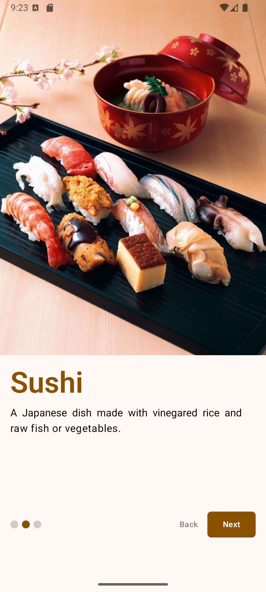
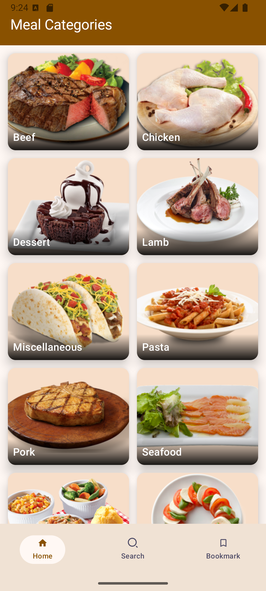
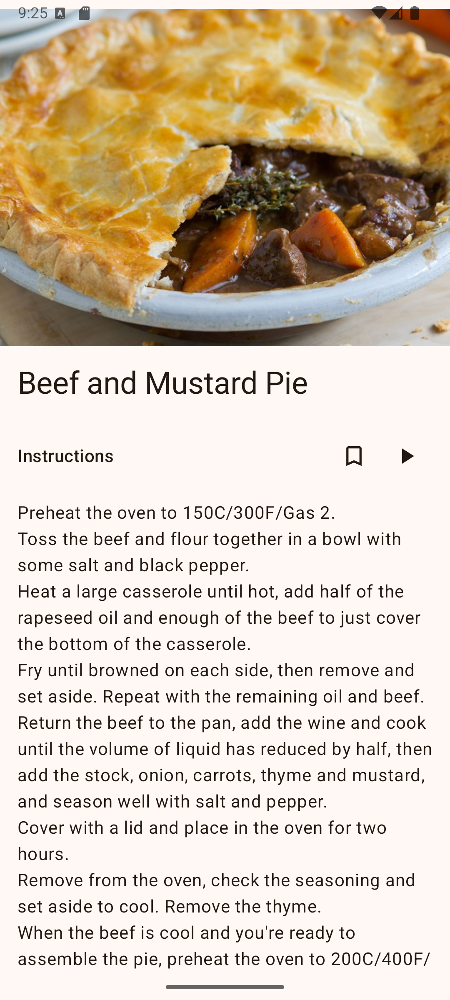
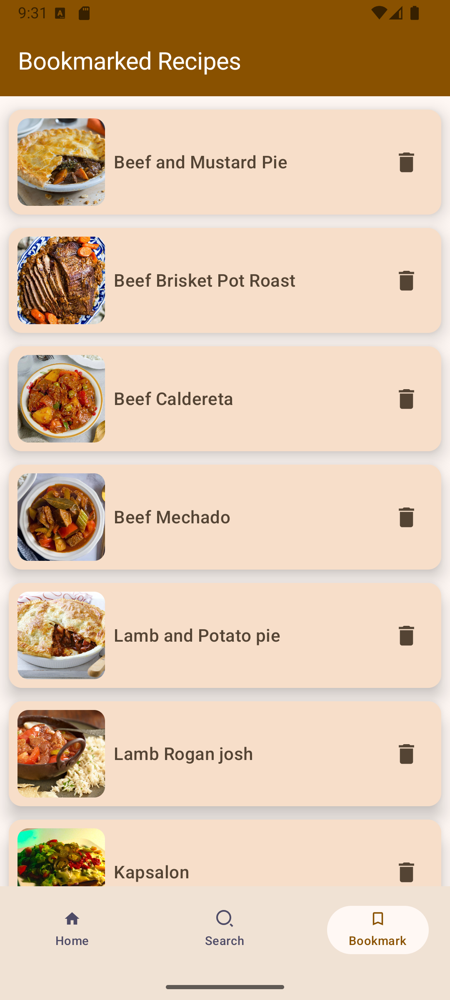
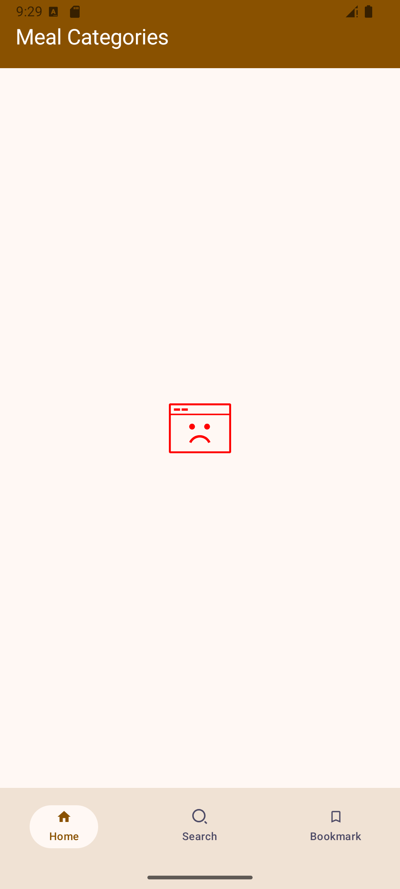

# 👋 Hi, I'm Meraj Hossen Akib  

I am an aspiring **Android developer** actively building projects to strengthen my skills in mobile development.  
I’ve applied **Jetpack Compose, Kotlin, Dagger Hilt, Retrofit, and RoomDB** in my apps, and I’m currently focused on gaining more confidence in independent development through real-world practice.  

---

## 🛠️ Skills  
| | |
|---|---|
| Android Studio | Retrofit & REST APIs |
| Kotlin & Coroutines | Dagger Hilt |
| Jetpack Compose | RoomDB | 

---

## 📂 Projects  

### 🔎 Highlights
- 📰 **News App** – Learned industry practices (Clean Architecture, MVVM, modern Android tools)  
- 🍲 **Food Recipe App** – Solo project to solidify knowledge and add bookmarking with RoomDB  
- 📺 **Notice Board TV App** – Real-world problem solving with kiosk mode for large displays  

---

### 📰 News App  
**Description:**  
An Android app with a splash screen, onboarding flow, API-based news fetching, search functionality, and detailed article views.  
🔗 [GitHub Repository](https://github.com/Akibilies20001/News_App)  

**Motivation:**  
This project helped me learn **industry practices** such as Clean Architecture, MVVM, and dependency injection. I built it by following a structured tutorial by **[ Land of coding on YouTube](https://www.youtube.com/playlist?list=PLzZEuVaFb9Exi-pc8qtHBrrLg8bUn-TP6)**, which introduced me to **Clean Architecture, Paging 3, Retrofit, and Dagger Hilt**, giving me my first exposure to advanced Android development standards.  

**Tools Used:** Jetpack Compose, Kotlin, Retrofit, Dagger Hilt, Paging 3, RoomDB  

**Screenshots:**  
  
  
  
 

---

### 🍲 Food Recipe App  
**Description:**  
A recipe browsing app with a splash screen, onboarding flow, recipe search, detailed views, and a **bookmarking feature using RoomDB**.  
🔗 [GitHub Repository](https://github.com/Akibilies20001/Food_Recipe)  

**Motivation:**  
This was my **first solo project** to solidify knowledge gained from tutorials. I independently added the bookmarking feature, applying **RoomDB** for persistent storage while reinforcing my skills with **Jetpack Compose, Kotlin, and dependency injection**.  

**Tools Used:** Jetpack Compose, Kotlin, Retrofit, Dagger Hilt, RoomDB  

**Screenshots:**    

<table align="center">
  <tr>
    <td align="center" width="33%">
       
      Onboarding Screen
    </td>
    <td align="center" width="33%">
       
      Meal Categories
    </td>
    <td align="center" width="33%">
       
      Categorized Recipes
    </td>
  </tr>

  <tr>
    <td align="center" width="33%">
       
      Search Screen
    </td>
    <td align="center" width="33%">
       
      Recipe Detail
    </td>
    <td align="center" width="33%">
       
      Bookmarked Recipes
    </td>
  </tr>

  <tr>
    <td align="center" colspan="3">
       
      No Internet Error
    </td>
  </tr>
</table>
---

### 📺 Notice Board TV App  
**Description:**  
An Android TV app built with **WebView** to render a university notice board website on large displays. Includes a **kiosk mode** for uninterrupted viewing in public spaces.  
🔗 [GitHub Repository](https://github.com/Akibilies20001/Notice_Board_DIU)  

**Motivation:**  
This project was my first attempt at solving a **real-world problem**: displaying content seamlessly on big screens. It gave me practical experience with **Java and XML UI development**, while exploring how Android behaves on **non-mobile devices like TVs**.  

**Tools Used:** Java, XML, WebView  

**Screenshots:**  
  

---

## 🎓 Education  
- **BSc in Computer Science and Engineering** – BRAC University (CGPA: 3.59 / 4.0)  
- **HSC in Science** – Udayan Uchcha Madhyamik Bidyalaya (GPA: 4.42 / 5.0)  

---

## 📫 Contact  
- 📧 Email: [merajhossen20001@gmail.com](mailto:merajhossen20001@gmail.com)  
- 💼 LinkedIn: [linkedin.com/in/meraj-hossen-akib-005486291](https://www.linkedin.com/in/meraj-hossen-akib-005486291/)  

---

